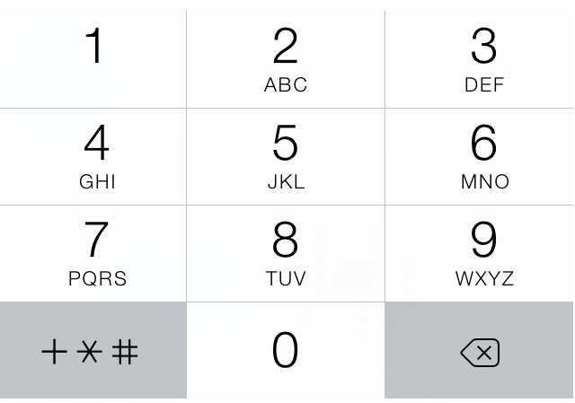

# numeric-pattern [](https://travis-ci.org/bendrucker/numeric-pattern)

> The numeric pattern (triggers the number pad on mobile)

[](http://bradfrost.com/blog/mobile/better-numerical-inputs-for-mobile-forms/)

## Install

```
$ npm install --save numeric-pattern
```


## Usage

```js
var numericPattern = require('numeric-pattern')
//=> [0-9]*
```


## License

MIT © [Ben Drucker](http://bendrucker.me)
